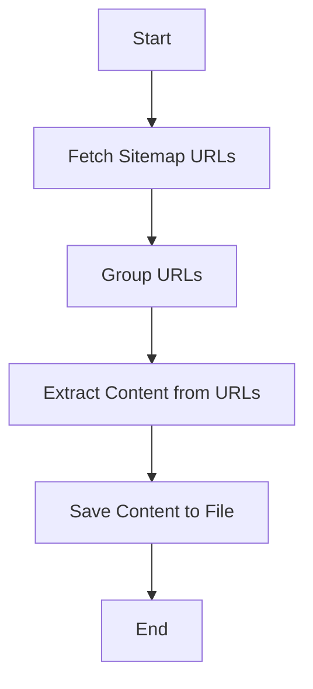

# Python Web Scraper


## Table of Contents
- [Introduction](#introduction)
- [Technology Stack](#technology-stack)
- [Architecture](#architecture)
- [Packages Used](#packages-used)
- [Installation](#installation)
- [Usage](#usage)

## Introduction
This project is a web scraper that extracts content from a given website's sitemap. It saves the extracted content into a text file, organized by URL groups.

## Technology Stack
- **Python 3.8+**: The programming language used for this project.
- **Requests**: For making HTTP requests to fetch web pages and sitemaps.
- **BeautifulSoup**: For parsing HTML content and extracting meaningful data.
- **Colorama**: For colored terminal output to enhance readability.

## Architecture
The architecture of this web scraper is straightforward. It involves fetching the sitemap, extracting URLs, grouping them, and then scraping content from each URL. The content is saved into a text file.



## Packages Used
- os: For interacting with the operating system, such as file paths.
- requests: For making HTTP requests to fetch web pages and sitemaps.
- BeautifulSoup: For parsing HTML content and extracting meaningful data.
- xml.etree.ElementTree: For parsing XML sitemaps.
- urllib.parse: For URL parsing and manipulation.
- collections.defaultdict: For grouping URLs.
- colorama: For colored terminal output to enhance readability.
- argparse: For parsing command-line arguments.
- string: For string manipulation and cleaning.

## Why These Packages?
- os: Essential for file operations and path manipulations.
- requests: A simple and elegant HTTP library for Python, perfect for making web requests.
- BeautifulSoup: A powerful library for parsing HTML and XML documents, making it easy to extract data.
- xml.etree.ElementTree: A lightweight XML parser included in the Python standard library.
- urllib.parse: Provides functions for manipulating URLs, which is crucial for web scraping.
- collections.defaultdict: Simplifies the process of grouping URLs.
- colorama: Enhances terminal output with colors, making it easier to read and debug.
- argparse: A standard library for parsing command-line arguments, making the script more flexible and user-friendly.
- string: Provides useful string manipulation functions.
  
## Installation

1. Clone the repository:
```bash
git clone https://github.com/diyakamboj/python-web-scraper
cd python-web-scraper
```

2. Create and activate virtual environment:
```bash
# Windows
python -m venv venv
.\venv\Scripts\activate

# Unix/MacOS
python3 -m venv venv
source venv/bin/activate
```

3. Install dependencies:
```bash
pip install -r requirements.txt
```

## Usage
1. Run the script:

```bash
python python-web-scraper.py https://www.example.com
```
2. Output: The script will save the scraped content into a text file named `<domain>_<group>_content.txt` in the current working directory.

Example
To scrape content from `https://www.example.com`, run

```bash
python python-web-scraper.py https://www.example.com
```

This will fetch the sitemap, extract URLs, group them, and save the content into a text file.

## Conclusion
This Python web scraper is a simple yet powerful tool for extracting content from websites. By leveraging Python's rich ecosystem of libraries, it provides a robust solution for web scraping tasks.
